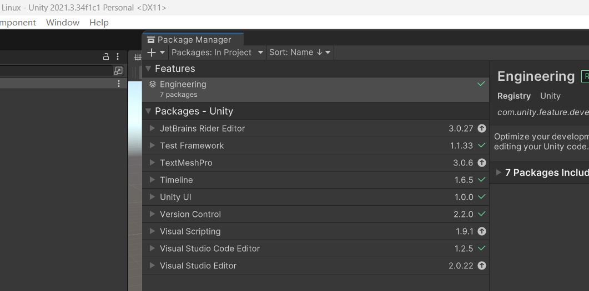
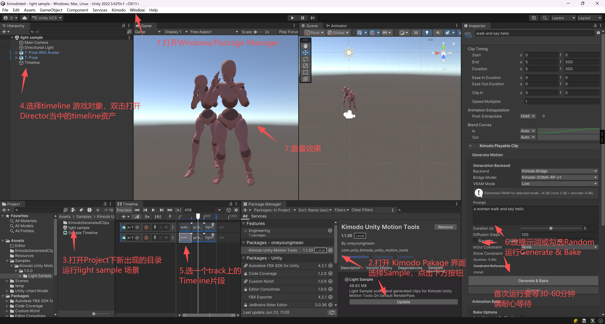

# 快速开始：用 Light Sample 跑通第一段 Kimodo 动画

> 本文带你用插件自带的 **Light Sample**（一个最小的 Timeline 演示场景）从零跑通「写提示词 → 生成 → 播放」的完整流程。
>
> **第一次使用强烈建议直接下载 [FullDemo](https://github.com/OneYoungMean/KimodoUnityBridge_FullDemo)**：它是一个开箱即用、已配好渲染管线和场景的完整 Unity 工程，省去你自己搭工程、调管线的麻烦。Light Sample 适合你已经有自己的工程、只想把插件接进去时使用。
>
> 两条路线最终跑的是同一套生成流程，本文以 Light Sample 为主线，FullDemo 用户可跳过「安装」直接看后面的章节。

---

## 0. 两种入门方式怎么选

| | Light Sample | FullDemo |
|---|---|---|
| 是什么 | 插件内置的 Sample，一个极简 Timeline 场景 + 几段示例 clip | 一个完整的独立 Unity 工程 |
| 适合谁 | 已有自己的工程，想把插件接进去 | **第一次用 Kimodo，想最快看到效果** |
| 怎么获取 | Package Manager → Samples → Import | 下载整个工程 Zip 直接打开 |
| 渲染管线 | 默认管线（Built-in RP） | 已配好 |

**结论**：第一次用就下 FullDemo；想了解最小集成方式再看 Light Sample。

---

## 1. 安装（来自主 README）

### 方式一：通过 Unity Package Manager（推荐）
1. 复制 Git 地址：`https://github.com/OneYoungMean/KimodoUnityBridge.git`
2. 打开项目的 **Package Manager**，点左上角 **+** → **Add package from git URL...**，粘贴上面的地址。
3. 等待完成。一切正常的话，菜单栏会出现 **Kimodo** 菜单。

### 方式二：通过安装包
1. 到 [Releases](https://github.com/OneYoungMean/KimodoUnityBridge/releases/latest) 下载第一个压缩包。
2. 解压到 `项目/Packages` 目录下。
3. 切回 Unity 等待编译完成，菜单栏出现 **Kimodo** 菜单即成功。

### 方式三：直接用 FullDemo
1. 下载 [KimodoUnityBridge_FullDemo](https://github.com/OneYoungMean/KimodoUnityBridge_FullDemo)（点 Download Zip 即可）。
2. 用 Unity 打开工程，直接运行查看效果。
3. 插件组件已放在 `KimodoUnityBridge_FullDemo/Packages` 目录下，无需再装。

> **环境要求**：Unity 2021+（FullDemo 工程为 2022.3），Windows / macOS / Linux。内存 ≥ 8G，硬盘可用空间 ≥ 10G。NVIDIA 显存 ≥ 6G 可走 CUDA（非强制，CPU 也能跑，只是慢）。

---

## 2. 打开场景、定位 GameObject、找到 Timeline

> 如果你用的是 **FullDemo**：场景已经摆好，无需导入 Sample。打开工程后到 `Assets/Scenes/` 下，里面是一组**按序号编排的引导场景**，直接从 **`0.StartUp`** 开始：
>
> | 场景 | 内容 |
> |---|---|
> | **`0.StartUp.unity`** | **入口，第一次从这里开始** |
> | `1.Constraints.unity` | 约束 Marker 玩法 |
> | `2.InOutConstraint.unity` | 首尾约束（长动画 / 循环 / 过渡） |
> | `3.KeyFrame.unity` | 关键帧 |
> | `4.AnimatorWindow.unity` | 状态机里替换 / 衔接动作 |
> | `5.RuntimeInfiniteDemo.unity` | 发布版运行时实时生成 |
>
> FullDemo 用户打开 `0.StartUp` 后，跳到第 4 步「找到 Timeline 游戏对象」即可。下面的导入步骤是给 Light Sample 用户的。

1. 打开 **Package Manager**，在列表里选中 **Kimodo Unity Motion Tools**。
2. 切到 **Samples** 一栏，点击 **Light Sample** 旁边的 **Import** 按钮。
3. 导入完成后，会出现在 `Assets/Samples/Kimodo Unity Motion Tools/<版本号>/Light Sample/` 下。在 **Project** 窗口里找到 **light sample** 场景并双击打开。
4. 打开场景后，在 **Hierarchy** 窗口里找到名为 **Timeline** 的游戏对象（同场景还有 `Main Camera` 和 `Directional Light`）。
5. 选中 **Timeline** 对象，它身上挂着一个 **PlayableDirector** 脚本。在 Inspector 里点开它引用的 **Timeline 资产**（即 `Sample Timeline.playable`），打开 Timeline 窗口。
6. 在 Timeline 窗口里，**选中其中一个 Kimodo 片段（clip）**。选中后，Inspector 会显示该片段的全部生成设置。

---

## 3. 基本参数设置（Inspector → Generate Motion）

选中 Kimodo 片段后，Inspector 自上而下分为几组，最常用的是 **Generate Motion**：

| 参数 | 说明 |
|---|---|
| **Prompt** | 发送给后端的自然语言动作描述，例如 "a person walks forward and waves"。**描述越具体，结果越贴近预期**。 |
| **Duration (s)** | 生成片段的目标时长。改它会**同步改变时间轴上片段的长度**，这是有意为之，方便两段对齐。 |
| **Random / Seed** | 勾选 **Random** 时每次用随机种子（**第一次试建议勾上，否则会和示例 clip 生成一样的结果**）；取消勾选可填固定 **Seed** 来复现同一结果。 |

其它常用项：
- **VRAM 模式（Low / High）**：显存 < 6G 或 CPU 走 Low（NF4/INT8 文本编码器）；显存 ≥ 6G 且想要更高质量可走 High（FP16）。
- **InOut Constraint**：做长动画 / 循环 / 过渡时用。把后一段设为 **Outside** 会自动对齐前一段的结尾姿势，逐段接力即可拼出长动画。第一次跑可以不管。
- **Show Constraint**：勾上能在 Scene 视图里预览约束姿势的位置。
- **Advanced**：关键帧精简（Position / Rotation / Float Error）。生成曲线关键帧太密导致卡顿时再调，一般保持默认。

设置好后点 **Generate & Bake**（或 Inspector 里的生成按钮）开始生成；生成中可点 **Cancel** 中止，**Reset** 可清掉本次记录重来。

---

## 4. 第一次运行为什么很慢

**第一次点生成会很久，这是正常的，不是卡死。**

第一次触发生成时，插件会自动在本地把整套运行环境和模型准备好：

- 用 `uv` 拉起一个独立的 Python 运行环境（不污染你的系统环境，即开即用、即删即走）。
- 下载 Kimodo 模型权重 + 文本编码器（LLM2Vec）等资产，**总量约 10G**。
- 首次启动 bridge server 时还有一次性的初始化和模型加载。

所以**第一次生成通常要 30–60 分钟**，主要时间花在下载那约 10G 的模型和环境上。这些只在第一次发生，**之后再生成就只剩推理时间**：CUDA 大约几秒，CPU 大约一分钟。

> **遇到报错怎么办**：第一次启动失败大多是**网络波动**导致下载中断，**重新点一次生成即可继续**，不必重装。若反复失败，去 `NvlabKimodoQuickServer~\log\` 下查看 `bridge_server.log` / `setup.log`。

---

## 5. 快速参考

**最短上手路径**
1. 装插件（或直接开 FullDemo）→ 2. Import Light Sample → 3. 打开 `light sample` 场景 → 4. 选中 Hierarchy 里的 **Timeline** 对象，打开它的 Timeline 资产 → 5. 选一个 clip → 6. 填 Prompt、勾 Random → 7. Generate & Bake → 8. 等待（首次 30–60 分钟）→ 9. 播放查看。

**关键位置速查**

| 你要找的 | 在哪里 |
|---|---|
| Light Sample 导入入口 | Package Manager → Kimodo Unity Motion Tools → Samples → Import |
| 场景文件 | `Assets/Samples/.../Light Sample/light sample.unity` |
| Timeline 对象 | Hierarchy 里名为 **Timeline** 的 GameObject（挂 PlayableDirector） |
| Timeline 资产 | `Sample Timeline.playable` |
| 生成参数 | 选中 clip 后的 Inspector → **Generate Motion** |
| 服务器 / 模型设置 | Project Settings → **Kimodo Server Manager** |
| 日志（排查报错） | `NvlabKimodoQuickServer~\log\bridge_server.log`、`setup.log` |

**Tips**
- 第一次：直接用 **FullDemo** 最省心。
- 想每次结果不同：勾 **Random**；想复现：取消 Random、填固定 **Seed**。
- 首次慢是在下约 10G 模型，只发生一次；报错多半是网络，重点一次即可。
- 长动画/循环：用 **InOut Constraint** 逐段接力（设 Outside 对齐上一段结尾）。

**进阶手册（`Manual/` 目录）**  
 [Kimodo Manual](Manual/README.md)，
