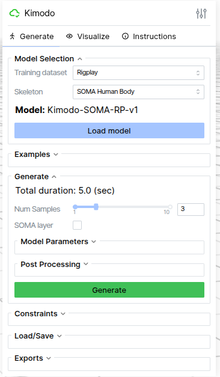
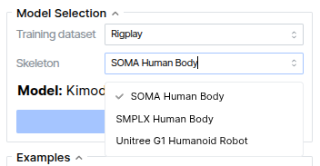
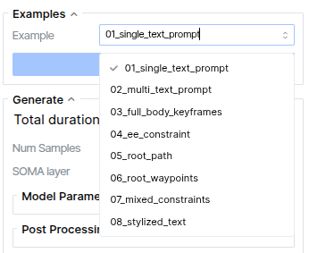

# KimodoUnityBridge

在 Unity 里更轻松地体验 Kimodo 动作生成。

如果你是第一次使用，可以把它理解成一个“从输入描述，到生成动作，再到预览结果”的上手工具。



---

## Intro

`KimodoUnityBridge` 面向希望快速体验动作生成的新手用户。

你不需要先理解复杂的技术细节，只需要知道它可以帮你完成这些事情：

- 在 Unity 中生成角色动作
- 预览生成结果
- 反复修改描述并重新尝试
- 用示例内容快速验证流程是否正常

如果你的目标只是“先跑起来一次”，这份 README 就够用了。


---

## Install

开始之前，先准备好下面几项：

- 已安装 Unity
- 已拿到当前项目或对应包
- 当前使用 Windows

如果你已经在本地拿到了项目，可以先进入目录：

```bat
cd /d C:\nvlab\KimodoUnityBridge
```

如果你需要启动本地服务，请进入：

```bat
cd /d C:\nvlab\KimodoUnityBridge\NvlabKimodoQuickServer~
```

然后运行：

```bat
run_server.bat --model Kimodo-SOMA-RP-v1 --output console
```

第一次启动可能会慢一点，属于正常情况。



---

## Quick Start

第一次使用，建议你只做下面这几步。

### 1. 启动本地服务

```bat
cd /d C:\nvlab\KimodoUnityBridge\NvlabKimodoQuickServer~
run_server.bat --model Kimodo-SOMA-RP-v1 --output console
```

### 2. 打开 Unity 项目

- 打开项目
- 等待加载完成
- 打开示例场景或示例内容

### 3. 打开 Kimodo 面板

- 找到对应工具入口
- 选择角色
- 输入一句简单描述

第一次建议使用非常直接的描述，例如：

```text
角色向前走
角色抬手挥手
角色转身后站定
```

### 4. 点击生成并预览

- 点击生成
- 等待结果返回
- 在预览区域查看效果
- 满意后再应用

---

## Example

下面是几个最适合新手的使用方式。

### 示例 1：先确认服务能启动

```bat
cd /d C:\nvlab\KimodoUnityBridge\NvlabKimodoQuickServer~
run_server.bat --model Kimodo-SOMA-RP-v1 --output console
```

### 示例 2：运行自带示例脚本

```bat
cd /d C:\nvlab\KimodoUnityBridge\NvlabKimodoQuickServer~
example\example_run_server_tpose.bat
```

### 示例 3：做一次最简单的文字生成

你可以尝试：

- 输入“角色向前走”
- 点击生成
- 观察动作结果

### 示例 4：修改描述再次生成

第一次成功后，可以继续尝试：

- 把提示词改短一点
- 把动作写得更具体一点
- 连续生成几次进行对比



---

## Manual

这部分不是技术文档，只是给新手的使用建议。

### 推荐使用顺序

1. 先启动服务
2. 再打开 Unity
3. 再打开面板
4. 再输入描述
5. 最后预览和应用

### 推荐的首次体验方式

- 先使用示例场景
- 先写最简单的动作描述
- 先确认流程跑通
- 再慢慢调整结果

### 不知道怎么写提示词时

可以从这些最基础的句子开始：

```text
角色站立
角色向前走
角色挥手
角色向左转身
```

### 结果不理想时

你可以优先尝试这些做法：

- 把句子写短一点
- 把动作写清楚一点
- 一次只改一个条件
- 多试几次再比较


---

## KnowIssue

下面是新手最常遇到的情况。

### 1. 第一次启动比较慢

通常是正常现象，先耐心等待，不要连续重复启动。

### 2. 点击生成后没有反应

先检查本地服务是否还在运行。

### 3. Unity 中没有看到相关工具

先确认项目已经正确打开，并等待 Unity 完成加载和编译。

### 4. 生成结果和预期不同

这很常见，建议先从更简单、更直接的动作描述开始。

### 5. 不确定问题出在哪里

最简单的排查顺序是：

1. 先确认服务能正常启动
2. 再确认示例脚本能运行
3. 最后再回到 Unity 里检查

---

如果你后面想继续完善这份 README，最值得补充的是两类内容：

- 新手一步一步的截图
- 一组开箱即用的提示词示例
